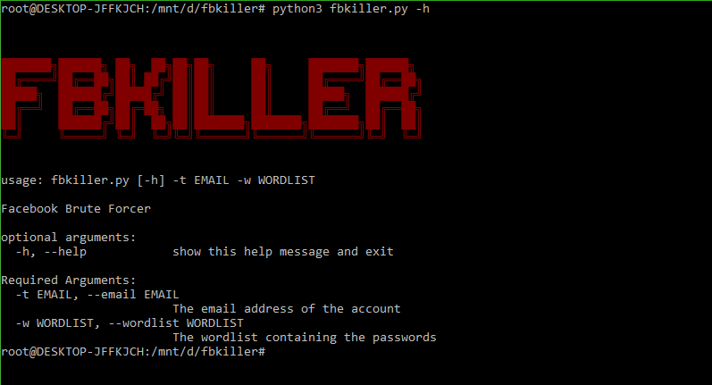
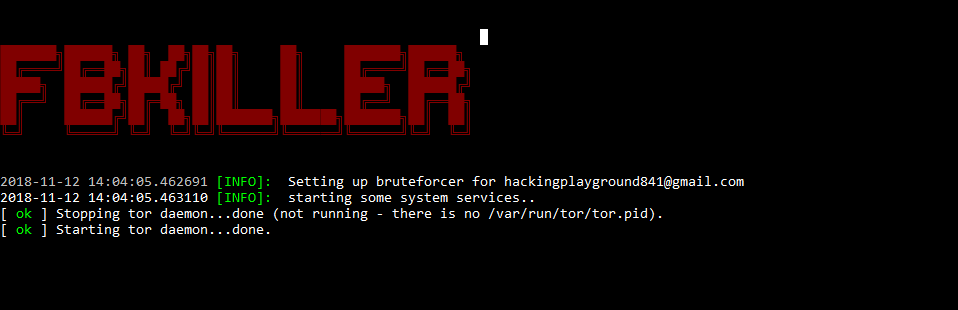
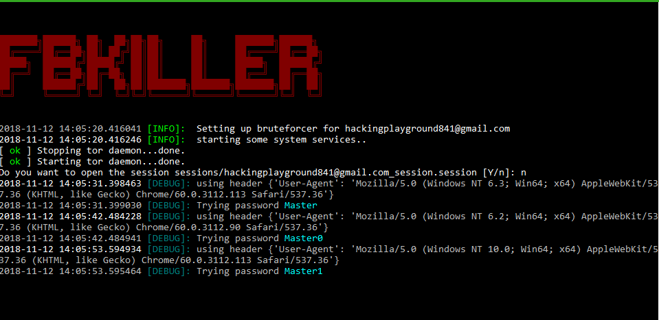
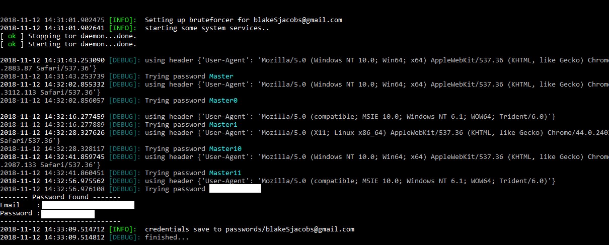

# fbkiller
Brute Forces A Facebook Account

### Description 
This is a facebook bruteforcer script, it attempts to crack a facebook account.

### How does it works?
Well, you need to specify the email address of the account and a wordlist,
what it will do is attempt to login to the facebook account with each word in the
dictionary. It uses ***TorRequests*** to bypass facebooks login security.
A VPN will give you better protection and more chances to brute force the account.

### How to install
Download it first.
`git clone https://github.com/ethicalhackingplayground/fbkiller.git`

Go to the directory.
`cd fbkiller`

Simply run,
`python3 setup.py`

### Usage:
`python3 fbkiller -h`

happy hacking.
